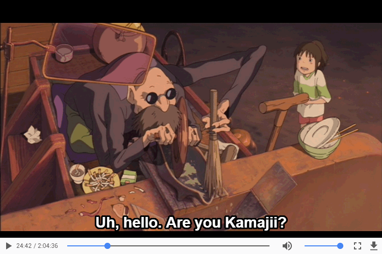

# video-subrip-layer-element

Element and player and for displaying and playing a video with SRT subtitles. Built for watching subtitled video content with Chromecast tab casting.

[Player here!](https://gkjohnson.github.io/subrip-video-layer-element/player/)



## subrip-video-layer Element

```html
<body>
  <subrip-video-layer src=".../subtitles.srt">
    <video controls src=".../movie.mp4"></video>
  </subrip-video-layer>
</body>
```

### Attributes

#### src

The url from which to load the SRT file.

## Caveats

- Clicking the full screen button on the video tag will full screen the video tag within, but not the subtitles layered on top.
- The element relies on the `<video>` tag events, so the contained video tag cannot be added or removed to and from the element dynamically.
